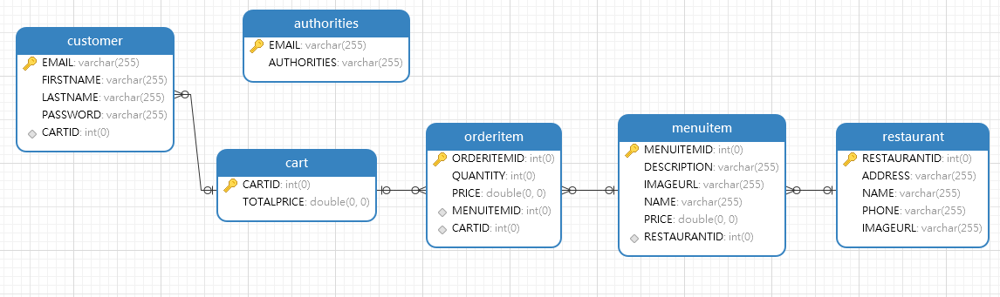

# onLineFoodOrder

## **Project Description**
A doordash like online food order web application that allows users order food online (_This repository only includes the backend portion of the project_).

## **Frameworks**
This project backend utilized SSM (Spring, Spring MVC, MyBatis) framework. It is a famous Java EE enterprise-level framework
after SSH(Struts, Spring, Hibernate). Spring MVC is loosely coupled compared to Struts and MyBatis is also a simpler and lighter-weight framework compared to Hibernate. MyBatis is a persistence framework which emphasizes on the use of SQL and maps SQL statements to 
Java methods, which is different from Hibernate which is an ORM maps Java classes to DataBase tables. 

## **Table of Contents**

### **Configurations**
The project is built by using XML configurations and properties file. 

**_`pom.xml`_** Configured maven to add dependencies, plugin, etc.

**_`web.xml`_** Initialized the Spring Core, Configured DispatcherServlet and SpringSecurity Filter Chain

**_`applicationContext.xml`_** Configured package annotation scan and mapper scan, TransactionManager, Druid datasource, and SqlSessionFactory

**_`springmvc.xml`_** Configured controller scan, three components ( RequestMappingHandlerMapping, RequestMappingHandlerAdapter, and ViewResolver)

**_`jdbc.porperties`_** Configured JDBC properties

**_`log4j2.xml`_** Log configuration

### **Database Schema**
The Java classes are defined under entity package. 

### **3 Layers**
**_`Controller Layer`_** <https://github.com/nanjiamoomoo/onlineFoodOrder/tree/zackary/src/main/java/com/project/controller>
This layer defines all the controllers and REST APIs. DispatcherServlet will send the request to the corresponding controller API based on the url. This layer handles the communication with frontend and all requests will go through this layer before sending to the service layer for processing. This layer does not handle service logic which is done in service layer. For example, the getRestaurants() method under RestaurantController (<https://github.com/nanjiamoomoo/onlineFoodOrder/blob/zackary/src/main/java/com/project/controller/RestaurantController.java>), this method is only responsible for receiving request and responding all the 
restaurants' info returned from service layer to the frontend. How to get the restaurants' info? Controller layer does not care! This mechanism decouples controller layer from service layer and makes the web application easy to maintain, and more reusable and robust. 

**_`Service Layer`_** <https://github.com/nanjiamoomoo/onlineFoodOrder/tree/zackary/src/main/java/com/project/service>
This layer contains all the service logic and mediates communications between controller and repository layer. For example, the addCustomer() method under service component CustomerServiceImpl (<https://github.com/nanjiamoomoo/onlineFoodOrder/blob/zackary/src/main/java/com/project/service/impl/CustomerServiceImpl.java>).
This method creates a new Cart, calls cartService.addCart() method and does all other necessary operations before calling the DAO layer to write the new customer to database. 

**_`DAO (Mapper) Layer`_** <https://github.com/nanjiamoomoo/onlineFoodOrder/tree/zackary/src/main/java/com/project/mapper>
This layer is responsible for connecting to database and do all the database CRUD(Create, Read, Update, Delete) operations. Under mapper package, defined all the interfaces and methods and these methods are mapped to the SQL statements under the corresponding xml file which are located under resources package (<https://github.com/nanjiamoomoo/onlineFoodOrder/tree/zackary/src/main/resources>). 
In this project, all the database operations are implemented by using interface proxy mode which means all the methods are self-defined and there are no need to instantiate SqlSession object to call its methods to achieve database operations and nor the need to define the implementation class of each interface, MyBatis framework does 
these all.

## **How to Test**

### **Set up database**
* Set up database and create tables based on the schema shown above. 
* Insert data into the restaurant table and menuitem table (restaurantinfo.sql and andmenuiteminfo.sql can be
used for testing). 
* Open jdbc.properties and change url under jdbc:mysql://url:3306/... with the actual database url to connect to the database

### **Test Database CRUD Operations with JUnit**
* Configure JUnit using Annotation @SpringJUnitConfig(locations = "classpath:applicationContext.xml").
* Create Test class under 'test' package and write test Method for each operation. For Example, test 'addOrderItem to Cart' reference  <https://github.com/nanjiamoomoo/onlineFoodOrder/blob/main/src/test/java/com/project/test/Test.java>.

### **Use Postman to test APIs**
* Download Postman to test the controller APIs
* Create signup request to register. Send POST request in JSON format to (http://localhost:8080/signup) such as
 {
  "email": "admin@gmail.com",
  "firstName": "admin",
  "lastName": "admin,
  "password": "123456"
  }
* Create login request. Send POST request to (http://localhost:8080/login) with the registered email and password (using "username" and "password" as the key)
* Similarly, test all other APIs using Postman
